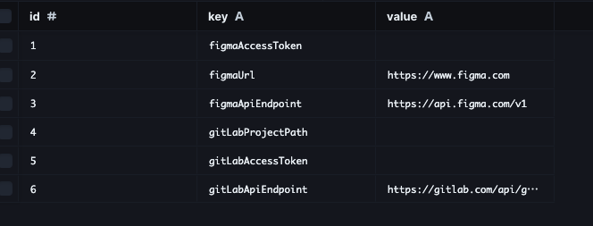
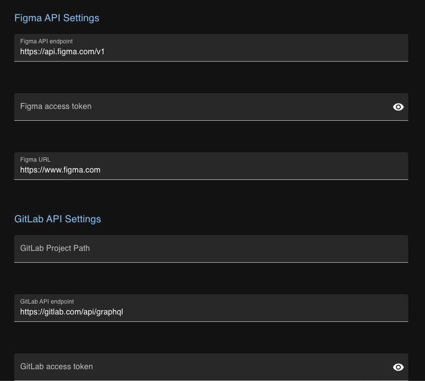

# Figma GitLab Bridge

> [日本語版 README はこちら](README_ja.md)

## Overview

This application is designed to integrate Figma and GitLab. The currently implemented feature is "FigJam Sticky To GitLab Issues," which allows you to register FigJam stickies as GitLab issues. This feature is intended for use in Agile planning where a planning board in FigJam is used to write tasks on stickies. Once planning is complete, you can use this feature to register the FigJam stickies as GitLab issues. The architecture is designed for extensibility, making it easy to add features.

## Features

- **FigJam Sticky To GitLab Issues**: Easily register FigJam stickies as GitLab issues.

## Prerequisites

- Node.js (v14 or higher)
- Git
- GitLab Account
- Figma Account

## Installation

1. Clone the repository

   ```
   git clone https://github.com/s-hiraoku/figma-gitlab-bridge.git
   ```

2. Navigate to the directory

   ```
   cd figma-gitlab-bridge
   ```

3. Install dependencies

   ```
   npm install
   ```

## Usage

1. Copy `.env-example` to `.env`.
2. Execute Prisma migration.

   ```
   npx prisma migrate dev --name init
   ```

3. Launch Prisma studio to confirm the migration

   ```
   npx prisma studio
   ```

   If it is generated as shown below, you have succeeded.

   

4. Start Figma GitLab Bridge and access http://localhost:3000.

   ```
   npm run dev
   ```

5. Set your Figma Access Token, GitLab Access Token, and the GitLab Project Path where you want to register the issues.
   

6. After completing the above settings, you can use the feature by clicking on the "FigJam Sticky To GitLab Issues" icon in the sidebar.

## License

This project is based on the MIT License - for more details, see the [LICENSE.md](LICENSE.md) file.
