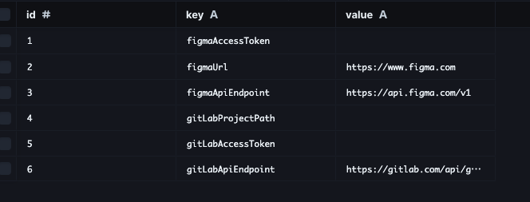
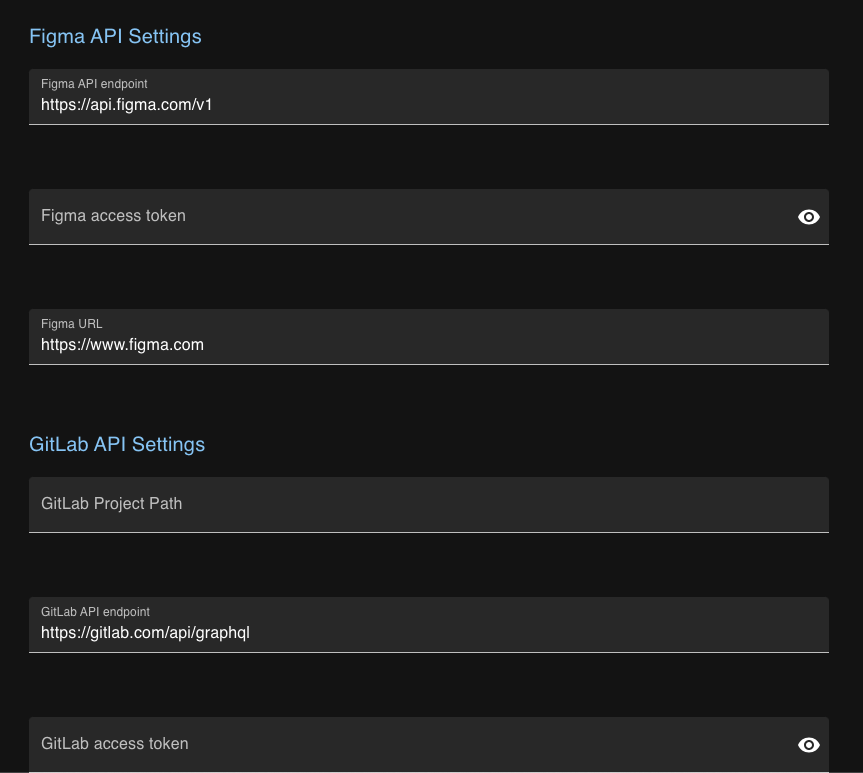

# Figma GitLab Bridge

## 概要

このアプリケーションは Figma と GitLab を連携するために作成されています。
現在実装されているのは「FigJam Sticky To GitLab Issues」という機能で、FigJam の付箋を GitLab の issues に登録できます。
この機能はアジャイルプランニングでプランニングボードに FigJam を使用してタスクを付箋に書くような運用をしていることを想定して、
プランニングが完了し、FigJam の付箋を GitLab の issues に登録するときに使う機能になります。
アーキテクチャは拡張性を持って設計されているため、機能の追加が容易にできます。

## 機能

- **FigJam Sticky To GitLab Issues**: FigJam の付箋を簡単に GitLab の issues に登録できます。

## 前提条件

- Node.js（v14 以上）
- Git
- GitLab アカウント
- Figma アカウント

## インストール

1. リポジトリをクローン

   ```
   git clone https://github.com/s-hiraoku/figma-gitlab-bridge.git
   ```

2. ディレクトリに移動

   ```
   cd figma-gitlab-bridge
   ```

3. 依存関係をインストール

   ```
   npm install
   ```

## 使い方

1. `.env-example` を `.env` にコピーします。
2. Prisma のマイグレーションの実行を行います。

   ```
   npx prisma migrate dev --name init
   ```

3. Prisma studio を起動してマイグレーションの確認

   ```
   npx prisma studio
   ```

   以下のように生成されていれば成功です。

   

4. Figma GitLab Bridge を起動し、http://localhost:3000 にアクセスします。

   ```
   npm run dev
   ```

5. Figma の Access Token と GitLab の　 Access Token、そして issues を登録する GitLab の Project Path を設定してください。
   

6. 以上の設定の完了後、サイドバーの FigJam Sticky To GitLab Issues のアイコンをクリックして使うことができます。

## ライセンス

このプロジェクトは MIT ライセンスに基づいています - 詳細は [LICENSE.md](LICENSE.md) ファイルを参照してください。
